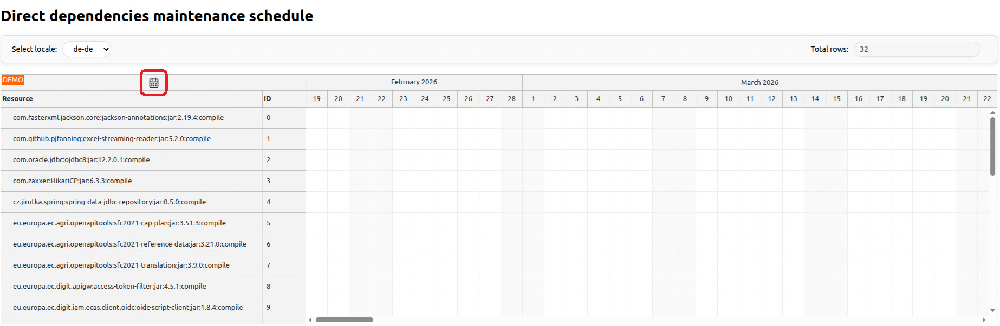
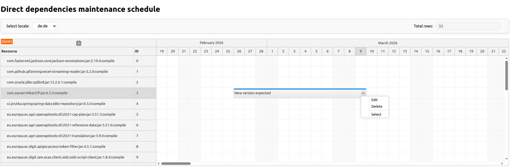

# Dependencies beyond the build phase

This is the code repository for .

## Description
- Uses [DayPilot Pro for JavaScript](https://www.daypilot.org/products/) - you may need to request a trial version and put it ... in order to see the front-end part, which is actually optional.
- This project builds on the [Using JavaScript/HTML5 Scheduler in Spring Boot (Open-Source)](https://code.daypilot.org/70997/using-javascript-html5-scheduler-in-spring-boot-java) tutorial by [DayPilot](https://www.daypilot.org/).

It is to demonstrate how a reliable information about dependenceis can be provided at runtime. 

This project uses [Maven](https://maven.apache.org/) for building, but nothing stops you to do the same with another framework.

At build time, the list of depenedencies is collected using the [Apache Maven Dependency Plugin](https://maven.apache.org/plugins/maven-dependency-plugin/tree-mojo.html) where the output type is <i>graphml</i>.
The resulting XML file is stored in the classpath, thus making it available at runtime.
This applies to each of the project's modules, if any.
The information is aggregated at runtime, so you'll be presented the list of dependencies across all modules.
Since the dependecies have their own dependencies, the resulting graph is a tree in XML format.
We are interested in managing dependencies, so only the direct (top level) nodes are retrieved from the tree and then aggregated.

An API is provided to expose a list of the manageable dependencies to the front-end. 
This API is designed for use with [DayPilot Pro for JavaScript](https://www.daypilot.org/products/), but could be implemented otherwise too.
An example initial screen is shown below.

The period is configurable - in this case it is 1 year from the current date. You can use the clendar icon to set the start date of the period.

Apart from the list of dependencies, it is possible to define a list of scheduled events for each of them.
You can add events using the mouse and then drag or resize them (change start / end time) the same way.
There is a context menu for each event, assigned to the right mouse button.

For the demo, event data is only kept in-memory. 
If you need persistent data, you can implement the interface otherwise - it is one of the standard Spring Framework interfaces.

Enjoy!

## License
- Same as the origin.
